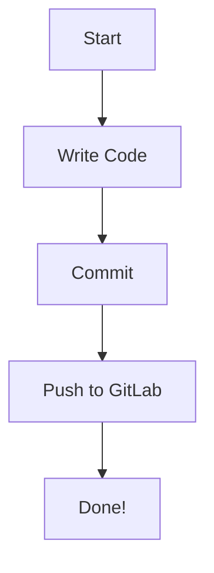

# Welcome to Stage 0

Nice that you made it. In this course you will work a lot with repositories so
you better start to like them as soon as possible ;)

In this course everything will be centered around your repository's issue tracker. Start with #1 and move on to the next one when you are finished.
## Contributors
- **Name:** Elrick DSouza
- **Matriculation Number:** 27846430
- **Email:** elrickdsouza18@gmail.com

## Sample Diagram

